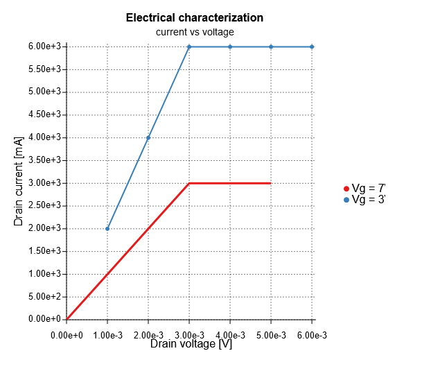

# react-plot

Library of React components to render SVG 2D plots.

<h3 align="center">

  <a href="https://www.zakodium.com" target="_blank">
    
  </a>

  <p>
    Maintained by <a href="https://www.zakodium.com" target="_blank">Zakodium</a>
  </p>

  [![NPM version][npm-image]][npm-url]
  [![npm download][download-image]][download-url]

</h3>

## [Storybook](https://zakodium.github.io/react-plot/)

```tsx
const Example = () => (
  <Plot
    width={550}
    height={500}
    margin={{ bottom: 50, left: 90, top: 50, right: 100 }}
  >
    <Heading
      title="Electrical characterization"
      subtitle="current vs voltage"
    />
    <LineSeries
      data={[
        { x: 0, y: 0 },
        { x: 1, y: 1 },
        { x: 2, y: 2 },
        { x: 3, y: 3 },
        { x: 4, y: 3 },
        { x: 5, y: 3 },
      ]}
      xAxis="x"
      yAxis="y"
      lineStyle={{ strokeWidth: 3 }}
      label="Vg = 7V"
      displayMarker={false}
    />
    <LineSeries
      data={[
        { x: 0, y: 0 },
        { x: 1, y: 1 },
        { x: 2, y: 2 },
        { x: 3, y: 3 },
        { x: 4, y: 3 },
        { x: 5, y: 3 },
      ]}
      xAxis="x"
      yAxis="y"
      displayMarker={true}
      markerShape="circle"
      label="Vg = 3V"
    />
    <Axis
      id="x"
      position="bottom"
      label="Drain voltage [V]"
      displayGridLines={true}
      max={6.1 / factor}
      tickStyle={{ fontSize: '0.8rem' }}
    />
    <Axis
      id="y"
      position="left"
      label="Drain current [mA]"
      displayGridLines={true}
      labelSpace={50}
      max={6.1 * factor}
      tickStyle={{ fontSize: '0.8rem' }}
    />
    <Legend position="right" />
  </Plot>
);
```

This code will result in this example



## Installation

`$ npm install --save react-plot`

## Debugging

For major React hooks debugging use [`@simbathesailor/use-what-changed`](https://github.com/simbathesailor/use-what-changed)

```tsx
import { useWhatChanged } from '@simbathesailor/use-what-changed';

function Example() {

  // useEffect, useCallback or useMemo
  useWhatChanged([a, b, c, d]); // debugs the below useEffect

  // displays names of variables instead of index
  // useWhatChanged([a, b, c, d], 'a, b, c, d', 'anysuffix-string');
  React.useEffect(() => {
    // console.log("some thing changed , need to figure out")
  }, [a, b, c, d]);
```

## License

[MIT](./LICENSE)

[npm-image]: https://img.shields.io/npm/v/react-plot.svg?style=flat-square
[npm-url]: https://www.npmjs.com/package/react-plot
[download-image]: https://img.shields.io/npm/dm/react-plot.svg?style=flat-square
[download-url]: https://www.npmjs.com/package/react-plot
